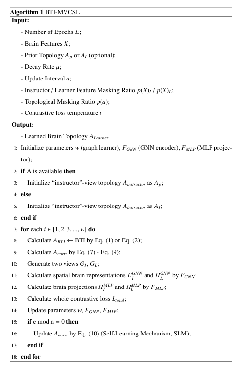

# BTI-MVCSL

**Decoding the Brain via Multi-view Brain Topology Contrastive Learning**

A Brain Topology Inference framework based on Multi-View Contrastive Self-supervised Learning (BTI-MVCSL) for fMRI-based neural decoding. (a) Brain topology inference (BTI) includes a series of graph learners for constructing appropriate “learner”-view topology; (b) Multi-view contrastive self-supervised learning (MVCSL) optimizes the brain topology through the consistency constraints between “instructor” and “learner” view; (c) Neural decoding identifies different brain states under different down stream tasks.

This is a pseudo code for 《Decoding the Brain via Multi-view Brain Topology Contrastive Learning》.

